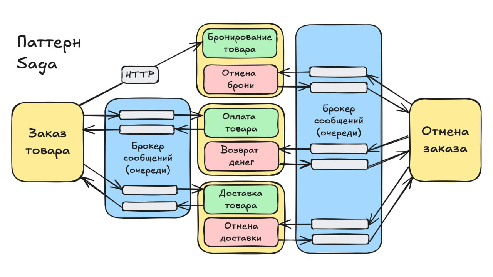

Как в ASP.NET Core зарегистрировать в DI объект, если его создание требует выполнения асинхронного метода?

Паттерн Сага сохраняет согласованность данных в микросервисной архитектуре, когда у каждого сервиса своя отдельная БД.

Сагой называется сложный сценарий обработки входящего запроса, когда в обработке запроса участвуют несколько микросервисов. Пример - заказ товара в интернет-магазине. Последовательная согласованная работа сервисов: управление запасами, прием платежей, доставка и т.д.

На любом шаге сценария может случиться, как техническая (пример - недоступность сервиса приема платежей), так и бизнес ошибка (пример - недостаток денег на счету клиента).

Если в середине саги возникла ошибка, то вся система оказывается в несогласованном состоянии, так как ранее завершенные успешные шаги бессмысленны или, даже, вредны. Пример: Ошибка на этапе оплаты,  а ранее единица товара была зарезервирована на складе. Если не отменить резерв, то эту единицу уже никто не сможет прибрести.

Сага это унифицированный способ исправления несогласованности данных в разных базах. Кратко: Для каждого шага сценария определяется компенсирующий (отменяющий, противоположный) шаг. И определяется компенсирующий (отменяющий) сценарий. В случае ошибки на любом из шагов основного сценария, запускается сценарий отмены.

Саги строятся по принципу оркестрации или по принципу хореографии. Оркестрация означает, что в системе есть модуль (оркестратор), который суть центральная точка управления сценариями. Он отслеживает статусы шагов, статус всей саги, продвигает сагу по шагам и запускает отмену саги в случае ошибки.

Хореография означает отсутствие единой точки оркестрации. Сага, как бы, размазывается по всей системе. Каждый сервис выполняет свою часть обработки и сообщает системе (событием) о завершении очередного шага. Потом следующий сервис реагирует на это событие и выполняет следующий шаг саги и т.д.

Чуть подробнее рассказал про сагу на ютубе - https://youtu.be/MLgHZWNSmnw
